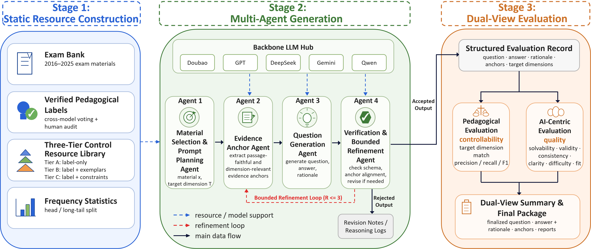

# 高考多智能体阅读题生成框架

语言: [English](README.md) | [中文](README.zh-CN.md)

<p align="center">
  
</p>

本项目是面向高考语文阅读理解任务的自动命题、求解与评估框架。系统将 **multi-agent（多智能体）** 的 Stage1 生成流水线与 **专家系统** 的 Stage2 评估层结合：GK（高考）维度与 CS（课标）维度的教育学评分细则编码了领域知识，既约束智能体的生成，也对每道题进行判定；同时由多模型集成对 AI 维度的质量进行打分。

## 核心功能

- Stage1 四智能体流水线：材料选择、证据锚点发现、题目生成与求解、轻量质量校验。
- 专家系统式评估：GK/CS 教育学维度细则（`data/gk_cs_eval.json`）与带硬锚点的 AI 维度细则（`data/ai_eval.json`）共同构成对每道题打分的知识库。
- Stage2 评估模式：`ai`、`gk`、`cs`、`gk+cs`、`ai+gk`、`ai+cs`、`ai+gk+cs`。
- Stage2 会自动去掉与 Stage1 生成模型同家族的评估模型，并对剩余模型权重重新归一化。
- AI 维度评估对每个模型只调用一次：若某模型在某维度的输出无效，则用其余评估模型在该维度上的打分融合补齐，绝不重复调用模型。
- 支持随机维度、hard-mix 维度、低频维度和无维度提示词等消融实验。
- 支持 Stage1 与 Stage2 分开运行，便于切换网络环境并实现可重复的评估运行。

## 快速开始

```bash
pip install -r requirements.txt
copy .env.example .env
python run.py --help
python run.py --run-mode single --unit-id 1 --dim-mode gk --prompt-level C
```

macOS 或 Linux 使用 `cp .env.example .env`，不要使用 Windows 的 `copy`。

## 配置说明

### 需要哪些 API key？

key 从项目根目录的 `.env` 读取（由 `.env.example` 复制而来）。启动时 `python-dotenv` 会自动加载 `.env`；若未安装该依赖，则需在 shell 中手动导出这些环境变量。

对于**出厂默认配置**（`STAGE1_PRESET=openai_official`、`STAGE1_MODEL=gpt-5.2`、`STAGE2_NETWORK=overseas`，评估模型为 `doubao-seed-1-6`、`gpt-5.2`、`deepseek-v3.2-exp-thinking`），只需两个 key：

`DOUBAO_API_KEY`、`DEEPSEEK_API_KEY`、`GOOGLE_API_KEY`、`QWEN_API_KEY` 仅在你把 Stage1/Stage2 切换到对应厂商直连时才需要。

### 在哪里修改设置

1. API key 和服务入口地址配置在项目根目录的 `.env` 文件中。先复制 `.env.example`，再填写所需厂商的 key 和可选的 DMX 入口地址。

2. Stage1 使用哪个模型、走哪个厂商入口，在 `src/shared/api_config.py` 中修改 `STAGE1_PRESET` 和 `STAGE1_MODEL`。`STAGE1_PRESET` 选择路由，`STAGE1_MODEL` 选择具体模型。

3. Stage2 评估网络环境在 `src/shared/api_config.py` 中修改 `STAGE2_NETWORK`。

4. Stage2 评估模型组在 `src/shared/api_config.py` 中通过 `STAGE2_EVAL_MODELS` 和 `STAGE2_MODEL_WEIGHTS` 配置。

## CLI 参考

除非显式指定 `--subset-size`，数据集级运行模式默认处理全部 181 个 unit。

| 模式 | 用途 | 示例 |
| --- | --- | --- |
| `single` | 运行单个 unit 的 Stage1 与 Stage2 | `python run.py --run-mode single --unit-id 1` |
| `full` | 默认运行全部 181 个 unit，也可按需运行抽样子集 | `python run.py --run-mode full` |
| `baseline` | 直接评估原始真题 | `python run.py --run-mode baseline --eval-mode gk` |
| `extract` | 从输出目录提取生成题目 | `python run.py --run-mode extract --extract-dir outputs/EXP_xxx` |
| `stage1-only` | 默认生成全部 181 个 unit 的 Stage1 产物 | `python run.py --run-mode stage1-only` |
| `stage2-only` | 评估已有 Stage1 输出目录 | `python run.py --run-mode stage2-only --stage1-dir outputs/EXP_xxx` |
| `ablation-nodim` | 默认对全部 181 个 unit 运行无维度提示词消融 | `python run.py --run-mode ablation-nodim --eval-mode ai+gk+cs` |

常用参数：

| 参数 | 含义 | 常用值 |
| --- | --- | --- |
| `--dim-mode` | Stage1 教育维度体系 | `gk`, `cs` |
| `--prompt-level` | 提示词详细程度 | `A`, `B`, `C` |
| `--eval-mode` | Stage2 评估器组合 | `ai`, `gk`, `cs`, `gk+cs`, `ai+gk+cs` |
| `--subset-size` | 可选的子集样本量；省略时默认运行全部 181 个 unit | 例如 `60` |
| `--subset-strategy` | 抽样策略 | `proportional_stratified`, `stratified`, `random` |
| `--exam-type` | baseline 真题范围 | `all`, `national`, `local` |

## 复现实验命令

```bash
# 单题运行
python run.py --run-mode single --unit-id 1 --dim-mode gk --prompt-level C

# 默认全量运行 181 题
python run.py --run-mode full --dim-mode gk --prompt-level C

# 先运行 Stage1，再切换网络环境运行 Stage2
python run.py --run-mode stage1-only
python run.py --run-mode stage2-only --stage1-dir outputs/EXP_xxx --eval-mode ai+gk+cs

# 原始真题 baseline
python run.py --run-mode baseline --eval-mode gk --exam-type national

# 无维度提示词消融
python run.py --run-mode ablation-nodim --eval-mode ai+gk+cs

# 提取生成题目
python run.py --run-mode extract --extract-dir outputs/EXP_xxx --extract-format markdown
```

## 项目结构

```text
├── run.py              # CLI 入口
├── src/
│   ├── shared/         # 共享配置、数据加载、LLM 封装和报告工具
│   ├── generation/     # Stage1 生成智能体与流水线
│   ├── evaluation/     # Stage2 AI/GK/CS 评估
│   └── showcase/       # 案例展示辅助工具
├── data/               # 核心实验数据与维度映射
├── scripts/            # 工具脚本
├── tools/              # 开发和审计工具
└── output_analysis/    # 输出分析包
```

## 许可证

代码采用 MIT License。详见 `LICENSE`。

随附的高考相关数据仅用于学术研究用途。
